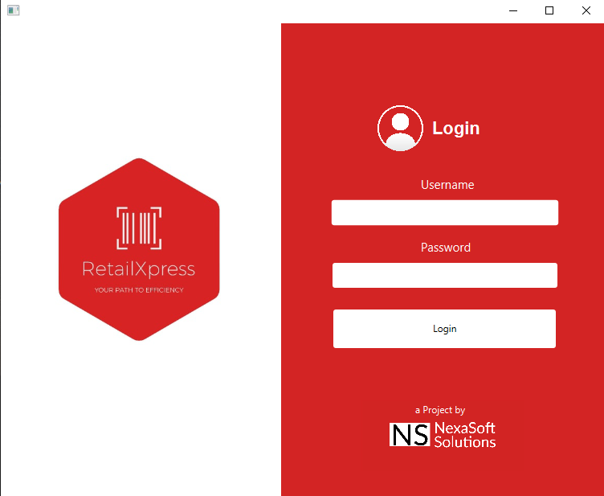
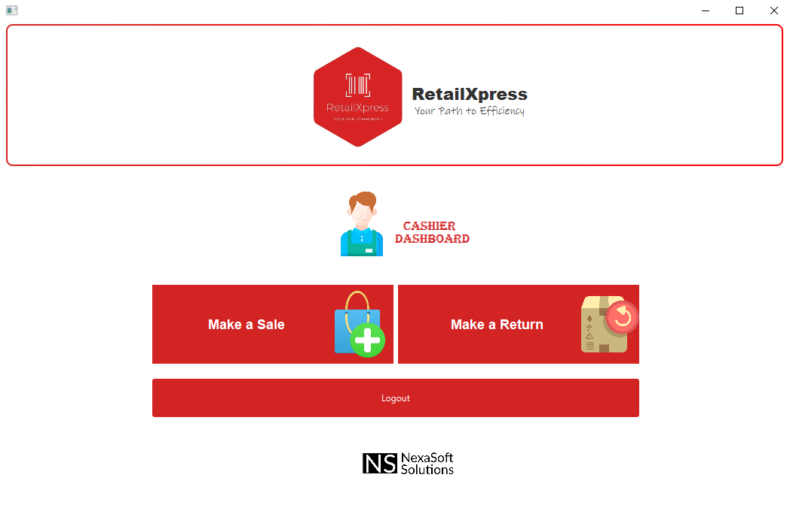
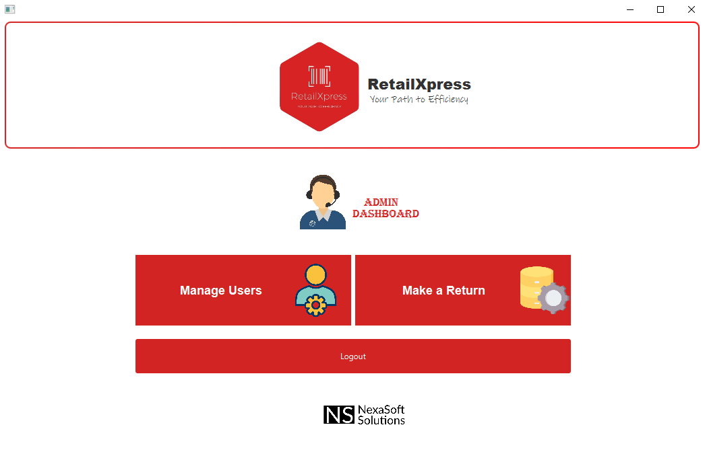
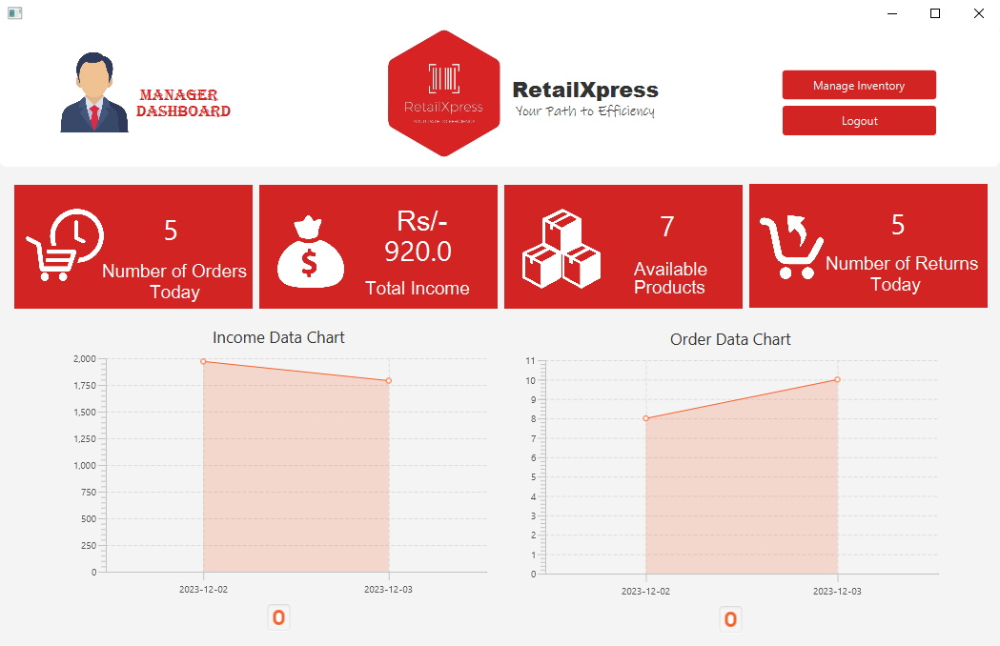
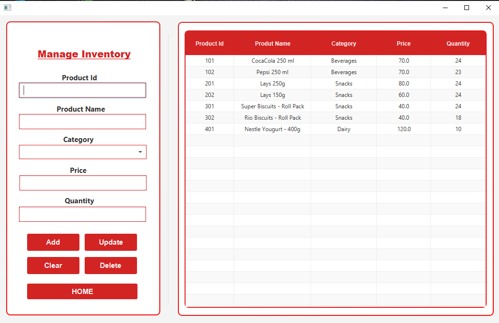

# RetailXpress - Your Path to Efficiency

## Overview
RetailXpress is a comprehensive Point of Sale (POS) system designed to streamline retail operations, enhance inventory management, and provide insightful sales reporting. With modules tailored for administrators, cashiers, and managers, RetailXpress offers a user-friendly interface and robust security measures, making it an ideal solution for modern retail environments.

## Features
- **Efficient Sales Processing**: Streamlined sales transactions for a seamless customer experience.
- **Real-Time Inventory Management**: Maintain accurate stock levels and facilitate timely restocking.
- **Comprehensive Reporting**: Actionable insights into sales performance and inventory metrics.
- **Secure User Authentication**: Robust user authentication mechanisms to safeguard sensitive data.
- **Customization Options**: Adapt the system to specific business needs with flexible customization.

## System Modules
1. **Admin Module**
   - Manage Users
   - View Sales Reports
   - Manage System Tables
   - System Configuration and Settings

2. **Cashier Module**
   - Make a Sale
   - Process Payments
   - Generate Receipts (Printed and Digital)
   - Manage Returns

3. **Manager Module**
   - Oversee Inventory Management
   - Analyze Sales Reports
   - User Roles and Permissions Management

## Nonfunctional Requirements
- **Performance**: Fast transaction processing (<2 seconds), real-time inventory updates (<5 seconds), and quick report generation (<10 seconds).
- **Safety**: Encryption of sensitive data and role-based access control to ensure security.
- **Reliability**: 99.9% system uptime to minimize disruptions.
- **Usability**: User-friendly interface with a high usability rating (95%+ user satisfaction).
- **Interoperability**: Seamless integration with external systems like payment gateways and inventory databases.

## Technical Specifications
- **Operating Environment**: Compatible with Windows.
- **Database**: SQL Server for efficient data management.
- **Hardware**: Standard POS terminals and desktop setups.
- **Peripheral Support**: Compatible with major peripheral devices like receipt printers.

## Use Case Scenarios
- **Login**: Secure user login based on role (Admin, Cashier, Manager).
- **Sales Processing**: From adding items to the cart to payment processing and receipt generation.
- **Inventory Management**: Real-time updates and stock level monitoring.
- **Reporting**: Detailed reports on sales, inventory, and user activities.

## Diagrams (Included in Report)
- **Use Case Diagram**: Overview of system interactions.
- **Domain Model**: Conceptual model of the system.
- **System Sequence Diagram**: Order of operations for key processes.
- **Class Diagram**: Object-oriented structure of the system.
- **Package Diagram**: Organization of the system into packages.
- **Deployment Diagram**: Physical deployment of the system.

## Business Rules
- Role-based access control ensures that users only have access to functionalities relevant to their roles.
- Administrators have the flexibility to adapt system settings to evolving business needs.
- Comprehensive user training programs ensure responsible and informed system usage.

## License
[MIT License](LICENSE)

## Screenshots

